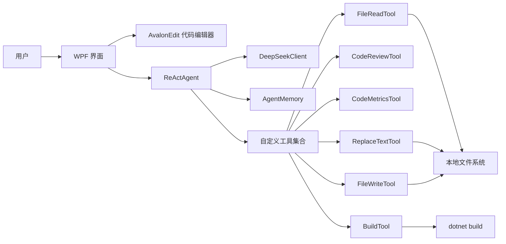
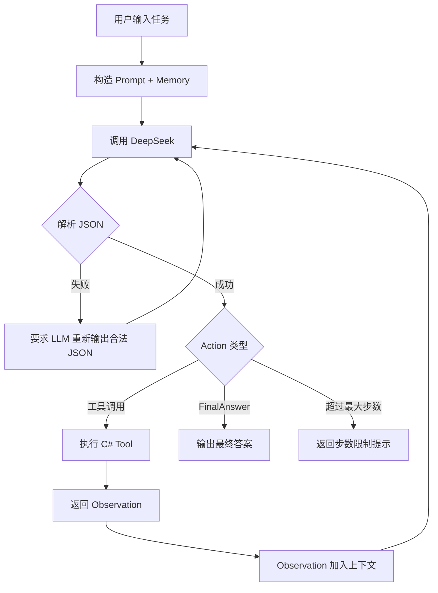

# 架构设计文档

## 1. 项目定位

本项目是一个参考 Cursor 交互方式的轻量级 C# 代码助手，定位为“Mini Cursor Agent”。它不是完整 IDE，而是围绕单个 C# 文件实现 AI 审查、修改和构建诊断。

## 2. 总体架构

## 3. Agent Loop 流程

## 4. 模块说明

### 4.1 UI 层

文件：`MainWindow.xaml`、`MainWindow.xaml.cs`

职责：

- 打开 C# 文件
- 显示和编辑代码
- 输入用户任务
- 显示 Agent 的 Thought / Action / Observation
- 控制是否允许 Agent 写入文件

### 4.2 LLM 层

文件：`LLM/DeepSeekClient.cs`

职责：

- 读取 DeepSeek API Key
- 构造 Chat Completions 请求
- 发送 HTTP 请求
- 解析模型回复
- 处理 API 错误

### 4.3 Agent 层

文件：`Agents/ReActAgent.cs`

职责：

- 构造 System Prompt
- 管理 ReAct 循环
- 解析 LLM 返回的 JSON 动作
- 调用对应工具
- 将 Observation 加入上下文
- 生成最终回答

### 4.4 Memory 层

文件：`Memory/AgentMemory.cs`

职责：

- 记录当前文件路径
- 记录当前编辑器代码
- 记录最近一次审查结果
- 记录最近一次指标结果
- 记录最近一次构建结果
- 记录最近一次写入路径
- 保存最近对话历史

### 4.5 Tools 层

文件：`Tools/*.cs`

职责：

- 把 Agent 的 Action 转换为确定性的 C# 操作
- 每个工具只负责一类任务
- 返回 Observation 给 Agent

## 5. 工具设计

| 工具 | 输入 | 输出 | 作用 |
|---|---|---|---|
| FileReadTool | path 可选 | 文件代码内容 | 读取当前或指定 C# 文件 |
| CodeReviewTool | code 可选 | 问题列表 | 规则式代码审查 |
| CodeMetricsTool | code 可选 | 指标统计 | 行数、方法数、复杂度 |
| ReplaceTextTool | oldText, newText | 修改结果 | 小范围替换代码 |
| FileWriteTool | content | 写入结果 | 整体写入代码 |
| BuildTool | path 可选 | dotnet build 输出 | 编译诊断 |

## 6. 安全设计

1. 写入前自动备份旧文件。
2. UI 提供“允许 Agent 写入文件”开关。
3. `FileWriteTool` 和 `ReplaceTextTool` 都会检查该开关。
4. `BuildTool` 只执行固定命令 `dotnet build`，不允许用户任意执行 Shell 命令。
5. Agent 回复必须是 JSON，防止把普通自然语言误解析成工具调用。

## 7. 可扩展方向

- 改用 Roslyn 做更准确的静态分析
- 支持多文件项目索引
- 支持 Git diff 预览
- 支持 Monaco Editor Web 版
- 支持流式输出
- 支持 RAG 项目知识库
