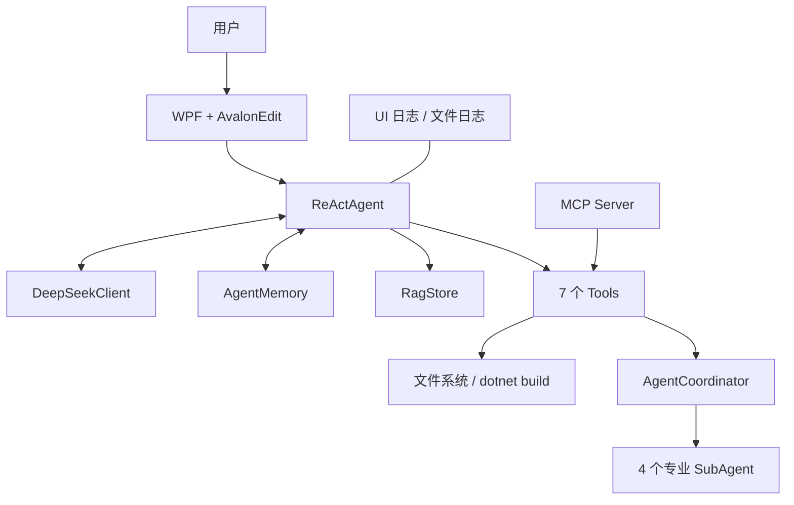
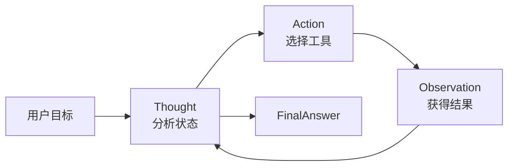
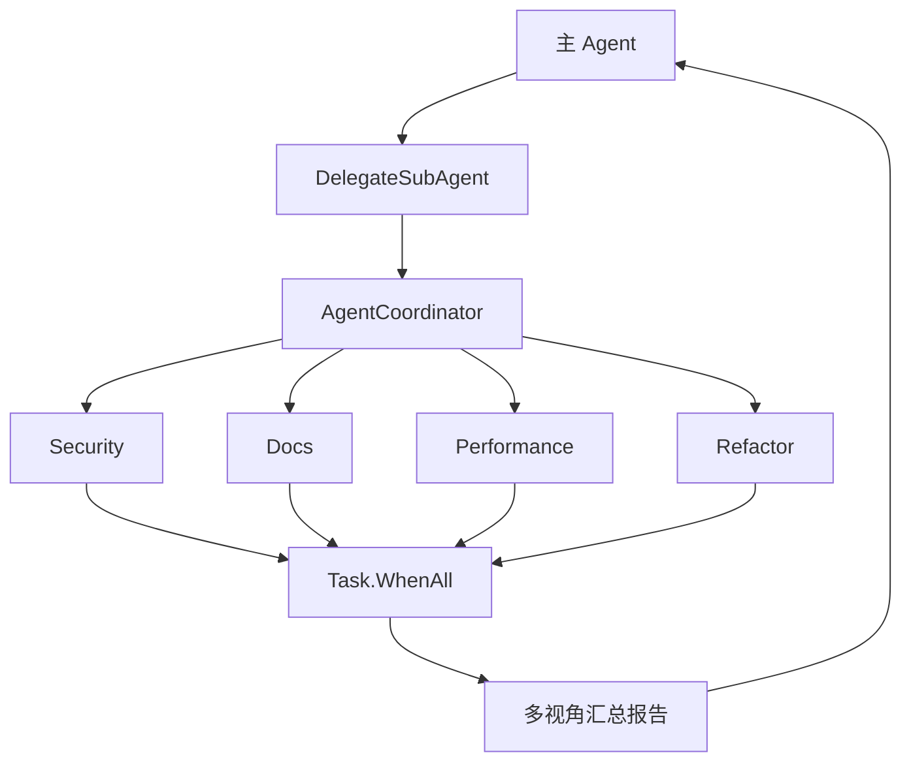

# Mini Cursor Agent 答辩 PPT 大纲与逐页讲稿

> 建议比例：16:9　｜　总页数：15 页　｜　目标时长：约 9 分 40 秒  
> 使用方式：每页的“页面文字”放进 PPT，“完整讲稿”放进备注区；不要把整段讲稿堆在页面上。  
> 截图前务必遮挡 API Key、个人目录和其他敏感信息。

---

## 第 1 页　封面：Mini Cursor Agent

**建议时长：20 秒**

### 页面布局

- 左侧约 40%：标题与个人信息。
- 右侧约 60%：软件主界面截图，添加轻微暗色遮罩。

### 页面文字

**Mini Cursor Agent**  
基于 .NET 8 的智能代码编辑与审查 Agent

- 课程：《.NET 程序设计》
- 姓名：〔姓名〕
- 学号：〔学号〕
- 班级：〔班级〕
- 指导教师：〔教师姓名〕

### 图片建议

使用程序启动后的完整主界面截图。编辑器中打开 `Samples/BadCode.cs`，右侧保留一小段 Thought、Action、Observation 日志，但不要出现 API Key 或完整本机路径。

### 完整讲稿

各位老师好，我的期末项目是 Mini Cursor Agent。它是一个基于 .NET 8 WPF 开发的智能代码编辑与审查工具，能够调用大语言模型进行推理，并通过本地工具完成代码读取、审查、修改和构建验证。接下来我会从需求、架构、Agent 原理、特色功能和测试结果五个方面介绍这个项目。

---

## 第 2 页　项目背景与目标

**建议时长：35 秒**

### 页面布局

采用“问题—方案—目标”三张横向卡片，中间用箭头连接。

### 页面文字

**问题**

- 代码阅读、审查、修改和构建需要频繁切换工具
- 普通聊天模型只能给建议，不能执行本地操作
- 自动修改代码存在误写和不可追踪风险

**方案**

- 让 LLM 负责理解目标与选择行动
- 用受控的 C# Tools 执行确定性操作
- 用 Memory、日志、备份和 Diff 保证过程可追踪

**项目目标**

> 实现一个能“思考—行动—观察—继续决策”的轻量级桌面代码 Agent。

### 图片建议

绘制一个简洁对比图：左侧为“编辑器、聊天网页、终端”三个分散窗口，右侧为 Mini Cursor Agent 单一界面。

### 完整讲稿

这个项目要解决的问题是：在传统开发过程中，代码阅读、审查、修改和构建往往分散在多个工具中；普通聊天模型虽然能提出建议，却不能安全地操作本地文件。因此，我把大语言模型作为决策大脑，把文件读写、代码分析和构建封装成受控工具，再通过记忆、日志、备份和 Diff 记录整个过程，使它真正具备 Agent 的执行能力。

---

## 第 3 页　课程要求完成情况

**建议时长：35 秒**

### 页面布局

使用两列表格，左侧是 PDF 中的要求，右侧是项目中的对应实现；已完成项使用绿色勾选。

### 页面文字

| PDF 核心要求 | 项目实现 |
|---|---|
| LLM 集成 | DeepSeek Chat Completions HTTP API |
| Agent Loop | 自写 ReAct 循环 |
| 至少 3 个工具 | 7 个自定义工具 |
| Memory | 对话历史与任务状态记忆 |
| 用户界面 | .NET 8 WPF + AvalonEdit |
| async/await | API、文件、构建均异步执行 |
| 错误处理与日志 | UI 分类日志 + 本地日志 + 异常处理 |

页面底部增加一行：**进阶实现：多 Agent、轻量 RAG、MCP Server、流式输出、80 项单元测试。**

### 图片建议

无需外部图片。表格右上角可放一个大号“核心要求 7/7”数字徽章。

### 完整讲稿

按照课程 PDF 逐项核对，本项目完成了全部核心要求：通过 HTTP 接入 DeepSeek，实现了自写 ReAct 循环；工具数量为七个，超过最低三个；同时具备短期记忆、WPF 交互界面、异步编程、错误处理和日志记录。在此基础上，我还实现了多 Agent、轻量级 RAG、MCP 服务端、流式输出和单元测试，这些对应课程中的进阶与加分方向。

---

## 第 4 页　系统总体架构

**建议时长：45 秒**

### 页面布局

整页使用分层架构图，按“交互层—Agent 层—能力层—基础设施层”从上到下排列。

### 页面文字



图旁放四个短标签：

- **UI：**接收任务、展示代码与执行过程
- **Agent：**推理、选择工具、控制循环
- **能力：**Memory、RAG、Multi-Agent、Tools
- **基础设施：**DeepSeek API、文件系统、MCP、日志

### 图片建议

将 Mermaid 重新绘制成 PPT 矢量架构图；主 Agent 使用醒目颜色，其余模块使用同色系浅色卡片。

### 完整讲稿

系统采用分层结构。最上层是 WPF 和 AvalonEdit 构成的交互界面；中间的 ReActAgent 是核心控制器，它一边调用 DeepSeek 获取下一步决策，一边读取 Memory 和 RAG 上下文。具体行动由七个工具完成，其中 DelegateSubAgent 可以进入协调器，并行启动四个专业子 Agent。工具也通过 MCP Server 对外暴露。整个过程中，界面日志和文件日志负责记录可观察的执行轨迹。

---

## 第 5 页　Agent 的核心：ReAct 循环

**建议时长：50 秒**

### 页面布局

左侧约 60% 放循环流程图，右侧放精简代码片段和四个关键词。

### 页面文字



右侧代码只保留核心结构：

```csharp
for (var step = 1; step <= _maxSteps; step++)
{
    var response = await _llm.ChatStreamingAsync(messages, ...);
    var decision = AgentDecision.Parse(response);
    var observation = await tool.ExecuteAsync(...);
    messages.Add(new("user", $"Observation: {observation}"));
}
```

页面强调：**最大 9 步｜每步一个动作｜Observation 回填上下文｜FinalAnswer 结束**

### 图片建议

流程图需要明显表现 Observation 回到 Thought 的闭环。代码截图使用 IDE 深色主题，但只截取核心 8～10 行。

### 完整讲稿

ReAct 循环是项目与普通聊天程序最本质的区别。程序先把用户目标和记忆交给模型，模型输出 Thought 和 Action；如果 Action 是工具名，程序就执行对应的 C# 工具，把结果作为 Observation 加回消息列表，然后进入下一轮。模型只有输出 FinalAnswer 才会正常结束。为了避免无限循环，我设置了最大九步，并限制每一步只能调用一个工具。这个闭环让模型能够依据真实执行结果不断修正后续行动。

---

## 第 6 页　LLM 与工具调用协议

**建议时长：40 秒**

### 页面布局

左侧显示一张 JSON 卡片，右侧用四步编号说明请求与容错流程。

### 页面文字

```json
{
  "thought": "需要先读取当前代码",
  "action": "FileReadTool",
  "actionInput": {}
}
```

**调用流程**

1. System Prompt 注入角色、规则和工具描述
2. DeepSeek 通过 SSE 流式返回 JSON
3. `AgentDecision.Parse()` 解析动作
4. 非法 JSON 时记录错误，并要求模型重新输出

**边界控制**

- 未注册工具不会执行
- API 失败、超时和格式异常均返回明确错误
- 达到最大步数后安全停止

### 图片建议

使用“请求 → SSE Token → JSON Decision → Tool”横向小流程；JSON 卡片可做成代码编辑器样式。

### 完整讲稿

为了让模型输出可被程序稳定解析，我没有直接处理自然语言，而是规定统一的 JSON 协议，包括 thought、action 和 actionInput。系统提示词会告诉模型当前有哪些工具以及行为边界。DeepSeek 通过 SSE 流式返回内容，程序再用 AgentDecision 解析。如果格式不合法，系统不会盲目执行，而是记录错误并要求模型重新输出；未知工具、网络错误和最大步数也都有对应的保护逻辑。

---

## 第 7 页　七个自定义工具

**建议时长：40 秒**

### 页面布局

使用五组彩色能力卡片，不要使用七行密集表格。

### 页面文字

**读取**

- `FileReadTool`：读取当前或指定文件

**分析**

- `CodeReviewTool`：规则式代码审查
- `CodeMetricsTool`：行数、方法数、复杂度等指标

**修改**

- `ReplaceTextTool`：局部替换
- `FileWriteTool`：整体写入

**验证**

- `BuildTool`：定位项目并执行 `dotnet build`

**协作**

- `DelegateSubAgent`：派发专业子 Agent 并行分析

页面底部：**统一实现 `IAgentTool`：Name + Description + ExecuteAsync**

### 图片建议

每组工具使用一个线性图标：文件、放大镜、铅笔、扳手、多人协作。不要使用网上复杂插画。

### 完整讲稿

项目共实现七个自定义工具，并统一实现 IAgentTool 接口。FileRead 负责读取；Review 和 Metrics 负责分析；ReplaceText 和 FileWrite 负责两种粒度的修改；BuildTool 负责调用 dotnet build 验证结果；DelegateSubAgent 则负责多 Agent 协作。这样设计的好处是，LLM 只决定做什么，真正的文件和构建操作由边界明确、可以测试的 C# 代码完成。

---

## 第 8 页　Memory：让 Agent 保持上下文

**建议时长：35 秒**

### 页面布局

中间放 AgentMemory 卡片，周围用六个信息气泡连接。

### 页面文字

**AgentMemory 保存：**

- 当前文件路径与编辑器代码
- 是否允许 Agent 写入
- 最近审查与代码指标结果
- 最近构建结果与写入路径
- 最近 20 条用户和助手对话

**进入下一轮 Prompt：**

> 当前任务状态 + 历史对话 + 工具 Observation

页面注释：长结果会截断，避免 Prompt 无限增长。

### 图片建议

绘制 Memory 中心节点图；用不同颜色区分“文件状态”“执行结果”“对话历史”。

### 完整讲稿

AgentMemory 提供了短期记忆和工作记忆。它不仅保存最近二十条对话，还保存当前文件、当前代码、写入权限、最近审查结果、指标结果、构建结果和写入路径。每次开始任务时，这些状态都会组织成摘要进入 System Prompt，使模型能够理解“继续修改”或者“根据刚才的构建错误处理”这样的上下文。较长的结果会被截断，避免 Prompt 无限制增长。

---

## 第 9 页　轻量级 RAG 知识增强

**建议时长：35 秒**

### 页面布局

用四步流水线：用户问题 → 分词与词频 → 余弦相似度排序 → Top-3 注入 Prompt。

### 页面文字

```text
用户任务
   ↓
内置 C# 知识库检索
   ↓ 词频向量 + Cosine Similarity
Top-3 相关条目
   ↓
注入主 Agent 上下文
```

**知识主题示例：**

- async/await 与异常处理
- 安全与敏感信息
- 日志、性能和代码规范

醒目标注：**这是轻量级词频检索原型，不是向量数据库。**

### 图片建议

画成“检索漏斗”而不是数据库架构图；右侧可放一张日志截图，展示“RAG 检索到 3 条相关知识”。

### 完整讲稿

为了让 Agent 在审查代码时获得稳定的 C# 参考知识，我实现了一个轻量级 RAG 原型。系统对用户问题和内置知识条目做词频统计，通过余弦相似度排序，选择最多三条内容注入主 Agent 的任务 Prompt。这里我需要如实说明：当前实现使用的是项目内置知识库和词频检索，并不是向量数据库。它验证了“检索后增强生成”的完整数据流，但仍有进一步升级空间。

---

## 第 10 页　多 Agent 并行协作

**建议时长：40 秒**

### 页面布局

中心为 AgentCoordinator，左右各放两个专业 Agent，底部汇聚为统一报告。

### 页面文字



**四种专业视角**

- Security：漏洞与敏感信息
- Docs：命名、注释与可读性
- Performance：异步阻塞与性能问题
- Refactor：结构、耦合与代码异味

### 图片建议

将四个角色设计为同一体系的头像图标或首字母徽章；箭头必须突出“并行”和“汇总”。

### 完整讲稿

当任务需要更深入的代码分析时，主 Agent 可以调用 DelegateSubAgent。协调器会根据角色参数启动 Security、Docs、Performance 和 Refactor 四类专业 Agent，并用 Task.WhenAll 并行等待结果。子 Agent 只获得读取和分析类工具，不能直接修改文件，降低了并行执行的风险。最终结果汇总回主 Agent，再由主 Agent决定后续修改或给出最终回答。

---

## 第 11 页　MCP、流式输出与可观测性

**建议时长：40 秒**

### 页面布局

分成三个竖向区域：MCP Server、Streaming、Observability。

### 页面文字

**MCP Server**

- `http://localhost:3001/mcp/`
- 支持 `initialize`
- 支持 `tools/list`、`tools/call`
- 将本地 `IAgentTool` 对外暴露

**Streaming**

- DeepSeek SSE 流式响应
- Token 到达后实时刷新界面
- 避免长时间等待的“无响应感”

**Observability**

- Step / Thought / Action / Observation
- FinalAnswer 与 Error 分类显示
- UI 日志 + 本地日期日志

### 图片建议

左侧放 MCP 面板初始化及工具列表截图；右侧放包含多种颜色日志类型的 Agent 日志截图。

### 完整讲稿

项目还实现了一个基础 MCP 服务端，监听本机三千零一端口，支持初始化、工具列表和工具调用，使同一套 IAgentTool 能以 JSON-RPC 形式对外提供。模型响应采用 SSE 流式读取，Token 到达后实时写入界面。与此同时，Step、Thought、Action、Observation、FinalAnswer 和错误采用分类样式展示，并同步写入日志文件，便于观察和复盘 Agent 的行为。

---

## 第 12 页　真实运行效果：从任务到审查结果

**建议时长：40 秒**

### 页面布局

使用三张带编号的真实截图横向排列，每张截图下方只有一句说明。

### 页面文字

1. **打开代码文件**  
   在 AvalonEdit 中查看和编辑 `BadCode.cs`
2. **输入自然语言任务**  
   “帮我审查当前文件，并指出可以改进的地方”
3. **观察 Agent Loop**  
   读取代码 → 执行审查 → 返回问题与建议

页面底部大字：**模型不是一次性回答，而是根据真实工具结果继续决策。**

### 图片建议

- 截图一：左侧编辑器已打开 BadCode.cs。
- 截图二：右侧输入框中出现完整任务。
- 截图三：日志中同时出现 Thought、Action、Observation 和 Final Answer。
- 所有截图统一裁切比例，并用红色框标出关键区域。

### 完整讲稿

这一页展示一次真实的代码审查流程。首先在编辑器中打开示例代码，然后输入自然语言任务。主 Agent 根据目标先读取当前代码，再调用审查或指标工具。每一次工具结果都会成为 Observation 回到上下文，最终生成包含具体问题和修改建议的回答。右侧日志完整保留了每一步，因此可以清楚看到结果是怎样产生的，而不是只看到最后一句答案。

---

## 第 13 页　代码修改与安全控制

**建议时长：35 秒**

### 页面布局

左侧放“修改前/修改后”Diff 截图，右侧放四层安全控制。

### 页面文字

**修改流程**

```text
用户授权写入
→ ReplaceText / FileWrite
→ 自动生成 .bak 备份
→ Diff 预览修改
→ BuildTool 编译验证
```

**安全控制**

- UI 写入开关默认限制修改权限
- 修改前自动备份原文件
- BuildTool 只执行固定的 `dotnet build`
- 未知工具和错误输入不会直接执行

### 图片建议

使用真实 Diff 预览截图，绿色标记新增、红色标记删除；旁边补一张构建成功的短日志。不要展示完整本机路径。

### 完整讲稿

代码修改属于高风险操作，所以项目增加了多层控制。只有用户允许写入后，ReplaceText 或 FileWrite 才能执行；修改已有文件前会自动创建 bak 备份，界面随后用红绿 Diff 展示变化。对于 .NET 项目，还可以调用 BuildTool 执行固定的 dotnet build，检查修改是否破坏编译。工具不能执行任意 Shell 命令，从而把 Agent 的行动范围限制在预定义能力内。

---

## 第 14 页　工程质量：80 项测试全部通过

**建议时长：45 秒**

### 页面布局

左侧放测试分类柱状图，右侧放终端测试结果截图和三个工程质量指标。

### 页面文字

**80 / 80 PASSED**

柱状图数据：

| 测试模块 | 数量 |
|---|---:|
| AgentDecision | 9 |
| CodeDiff | 10 |
| CodeMetrics | 8 |
| CodeReview | 11 |
| AgentMemory | 10 |
| File Tools | 14 |
| RAG | 10 |
| MCP Server | 8 |

右侧指标：

- `dotnet build`：0 Error，0 Warning
- `dotnet test`：80 Passed，0 Failed
- 覆盖正常输入、边界条件、权限限制和错误分支

### 图片建议

使用横向柱状图，File Tools 的 14 项使用强调色；终端截图必须清楚显示“通过 80、失败 0”。

### 完整讲稿

为了验证项目不是只能演示理想路径，我补充了八十项单元测试，并且全部通过。测试覆盖决策 JSON 解析、Diff、代码指标、规则审查、Memory、文件读写与备份、RAG 检索以及 MCP 协议。其中还包含空输入、文件不存在、禁止写入、未知工具和错误方法等边界情况。当前主项目编译结果为零错误、零警告，这些结果为核心功能和加分模块提供了可复现的质量证据。

---

## 第 15 页　反思、改进与总结

**建议时长：45 秒**

### 页面布局

上半部分左右对照“我的工作”和“当前不足”，下半部分放总结句与“Q&A”。

### 页面文字

**AI 使用说明**

- AI 辅助搭建项目框架并生成部分代码
- 我负责需求选择、代码理解、功能整合与问题修改
- 我补全了 80 项测试，并逐项验证核心模块

**当前不足**

- 主要面向单文件，缺少完整项目级索引
- RAG 是词频检索，尚未使用 Embedding 和向量数据库
- MCP 是基础实现，仍需更完整的协议兼容验证
- 规则式代码审查不如 Roslyn 精确

**总结**

> Mini Cursor Agent 已形成“LLM 决策 + ReAct 循环 + 受控工具 + Memory + 可观测执行”的完整 Agent 闭环。

页面右下角：**谢谢老师，请提问。**

### 图片建议

使用简洁的闭环图作为背景水印：目标 → 推理 → 工具 → 结果 → 验证。不要再加入新的功能截图。

### 完整讲稿

最后说明 AI 的使用情况：AI 辅助了项目框架和部分代码生成，我负责需求选择、代码理解、功能整合、问题修改，并补全和验证了八十项测试。项目目前仍以单文件场景为主，RAG 尚未升级为向量检索，MCP 也需要更完整的兼容性验证，规则审查未来可以改用 Roslyn。通过这次项目，我更深入地理解了 Agent Loop、工具边界和异步编程。总体来说，本项目已经实现了从模型决策、工具执行到结果验证的完整 Agent 闭环。我的汇报结束，谢谢老师，请各位老师提问。

---

# 截图与素材准备清单

制作 PPT 前建议准备以下素材，所有截图统一使用 16:9 页面中的圆角矩形裁切：

1. 软件完整主界面截图，用于第 1 页。
2. 打开 `BadCode.cs` 后的编辑器截图，用于第 12 页。
3. Thought、Action、Observation、FinalAnswer 日志截图，用于第 11、12 页。
4. MCP 初始化与工具列表截图，用于第 11 页。
5. 红绿 Diff 预览截图，用于第 13 页。
6. Build 成功日志截图，用于第 13 页。
7. `dotnet test` 显示 80/80 通过的终端截图，用于第 14 页。
8. 根据本大纲重新绘制的架构图、ReAct 图、多 Agent 图和测试柱状图。

# 10 分钟时间分配

| 部分 | 页码 | 建议时间 |
|---|---|---:|
| 开场与需求 | 1～3 | 1 分 30 秒 |
| 架构与核心原理 | 4～8 | 3 分 30 秒 |
| 进阶功能 | 9～11 | 1 分 55 秒 |
| 运行效果与工程质量 | 12～14 | 2 分钟 |
| 反思与结束 | 15 | 45 秒 |
| **合计** | **15 页** | **约 9 分 40 秒** |

# 制作前安全检查

- 撤销并更换曾写入 `appsettings.json` 的真实 API Key。
- PPT 截图中遮挡 API Key、用户名、磁盘路径和个人信息。
- 不把轻量词频 RAG 描述成向量数据库。
- 不把基础 MCP 实现描述成已经通过全部官方客户端兼容认证。
- 姓名、学号、班级和教师信息在提交前替换完整。
